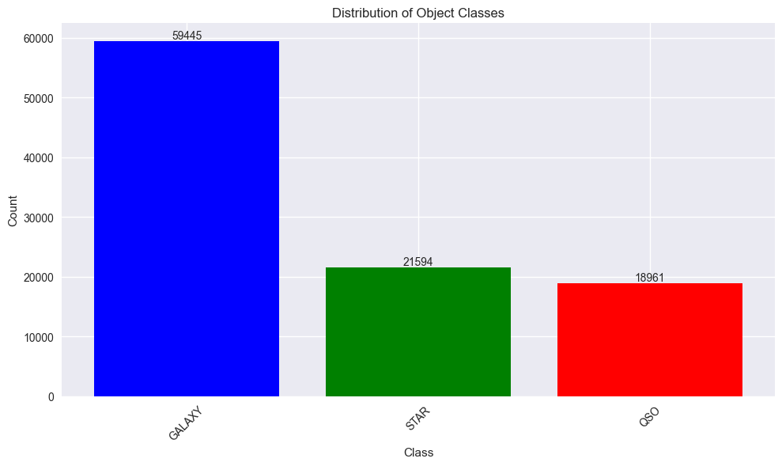
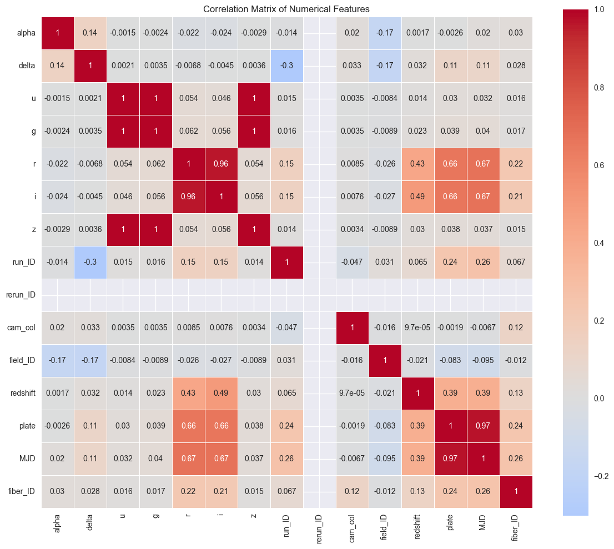
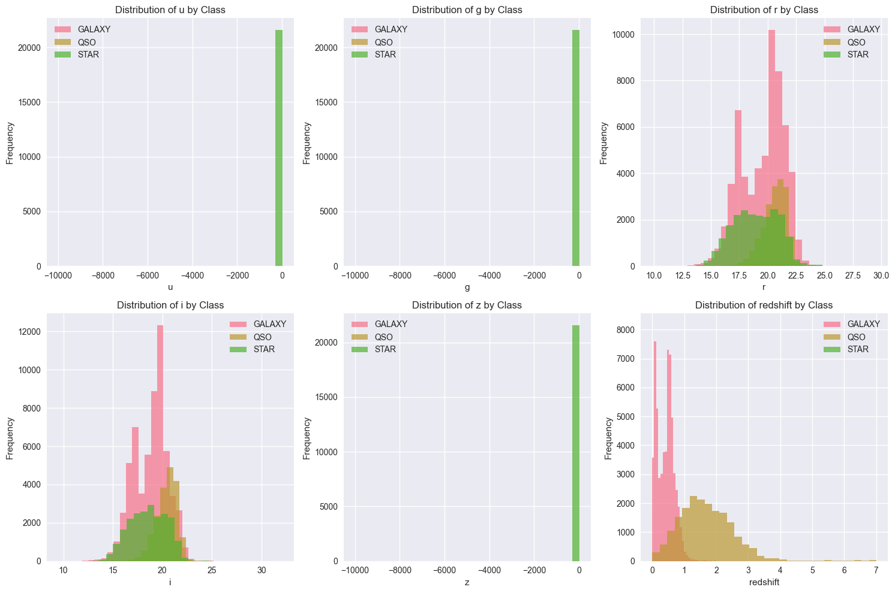
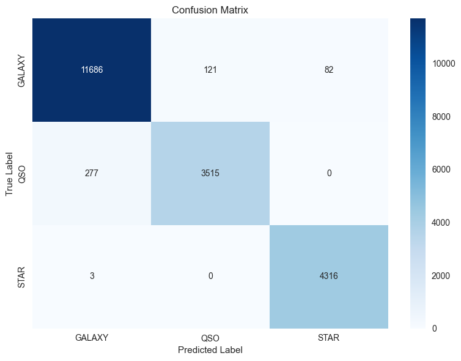
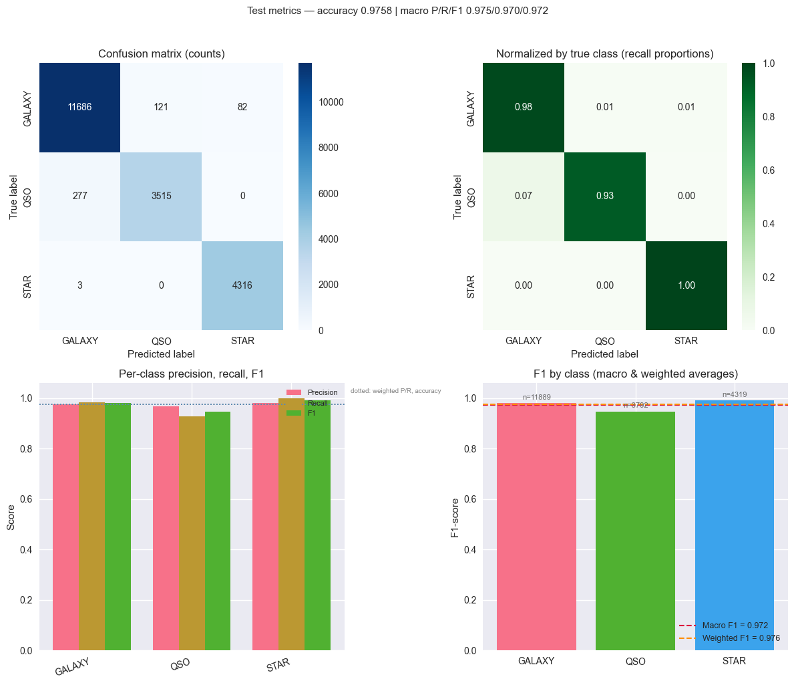
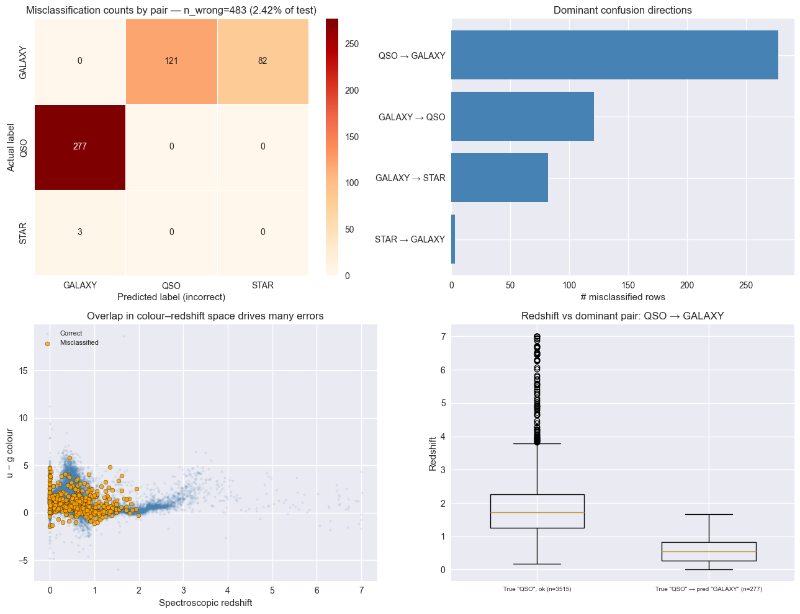
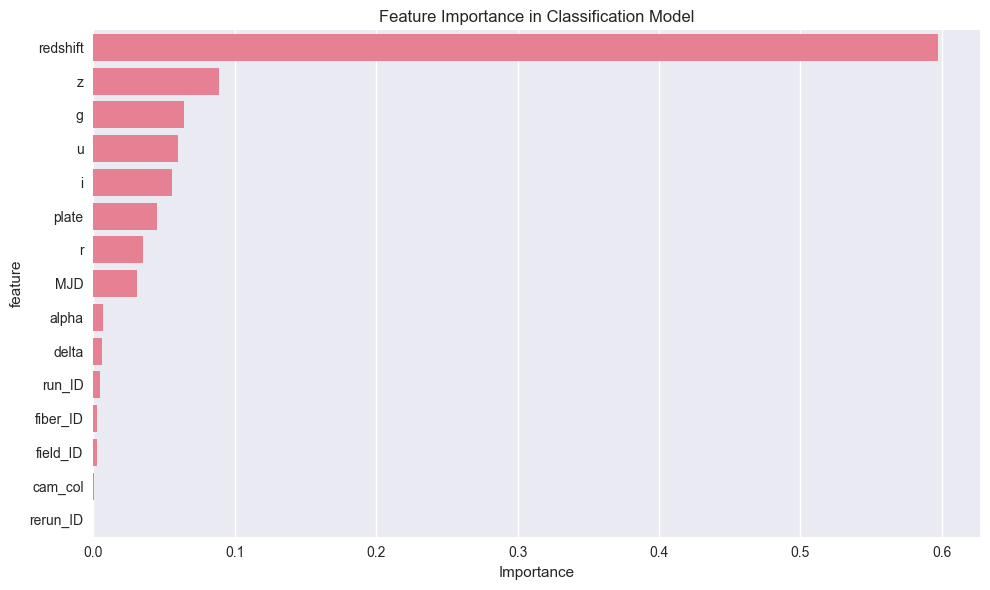

# SDSS / SDSS-style spectra classification

Supervised multiclass classification of astronomical objects (**star**, **galaxy**, **quasar**) from photometry and metadata similar to the Sloan Digital Sky Survey (SDSS). This repo includes a [Random Forest](https://scikit-learn.org/stable/modules/generated/sklearn.ensemble.RandomForestClassifier.html) baseline, a small Python package layout (`main.py`, `analysis.py`), and an interactive walkthrough in `sdss_analysis.ipynb`.

**Repository:** [github.com/prashantkul/sdss-spectra-classification](https://github.com/prashantkul/sdss-spectra-classification)

## Dataset

- **Source file:** `dataset/star_classification.csv` (100,000 rows, 18 columns).
- **Target:** `class` (GALAXY, STAR, QSO).
- **Features:** SDSS-style magnitudes `u, g, r, i, z`, positions (`alpha`, `delta`), `redshift`, plate/MJD/fiber identifiers, and related IDs.

## Model approach

- Random Forest classifier on scaled numeric features (`StandardScaler`).
- Train/test split, classification report, confusion matrix, optional cross-validation on the test split.
- Feature importance from the fitted forest.

## Results (from the notebook)

On the held-out test set (20,000 samples), the notebook reports **test accuracy ≈ 0.976** and **5-fold CV mean accuracy ≈ 0.974** (see `sdss_analysis.ipynb` for exact runs). Figures below are exported from the notebook outputs in `docs/plots/` (regenerate anytime by running the notebook and saving outputs).

### Class distribution



### Feature correlations



### Distributions by class



### Confusion matrix



### Precision, recall, F1, and normalized confusion matrices



### Misclassification analysis



### Feature importance



## Installation

```bash
git clone git@github.com:prashantkul/sdss-spectra-classification.git
cd sdss-spectra-classification
python -m venv .venv
source .venv/bin/activate   # Windows: .venv\Scripts\activate
pip install -r requirements.txt
```

For the notebook, install a kernel environment (e.g. `pip install ipykernel jupyter` or use `uv sync` if you use the `pyproject.toml` in this project).

## Usage

**CLI training / evaluation:**

```bash
python main.py
```

**Notebook:**

```bash
jupyter notebook sdss_analysis.ipynb
```

[](https://colab.research.google.com/github/prashantkul/sdss-spectra-classification/blob/main/sdss_analysis.ipynb)

*(After first push, upload `dataset/star_classification.csv` to Colab or mount Drive if you run remotely.)*

## Project layout

| Path | Role |
|------|------|
| `sdss_analysis.ipynb` | End-to-end EDA, training, metrics, plots |
| `main.py` | Script entrypoint |
| `analysis.py`, `load_data.py`, `config.py` | Training and data helpers |
| `dataset/` | CSV (and optional `archive.zip`) |
| `docs/plots/` | Notebook figures for the README |

## References

- [Sloan Digital Sky Survey](https://www.sdss.org/)
- [scikit-learn user guide](https://scikit-learn.org/stable/user_guide.html)
